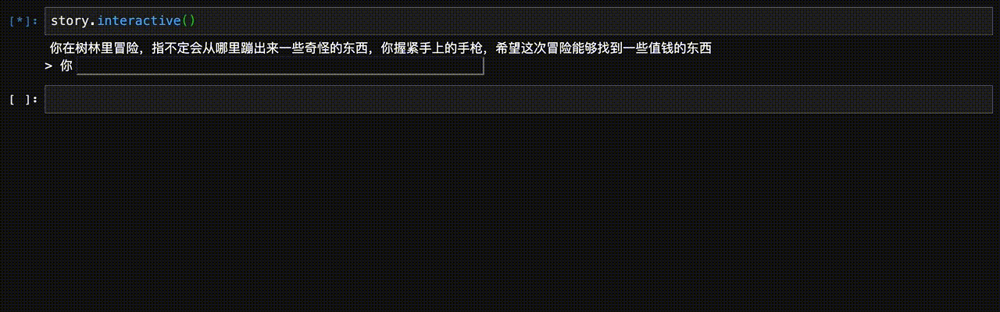

<pre>
    ▄████▄   ██░ ██  ██▓ ███▄    █ ▓█████   ██████ ▓█████      
   ▒██▀ ▀█  ▓██░ ██▒▓██▒ ██ ▀█   █ ▓█   ▀ ▒██    ▒ ▓█   ▀      
   ▒▓█    ▄ ▒██▀▀██░▒██▒▓██  ▀█ ██▒▒███   ░ ▓██▄   ▒███        
   ▒▓▓▄ ▄██▒░▓█ ░██ ░██░▓██▒  ▐▌██▒▒▓█  ▄   ▒   ██▒▒▓█  ▄      
   ▒ ▓███▀ ░░▓█▒░██▓░██░▒██░   ▓██░░▒████▒▒██████▒▒░▒████▒     
   ░ ░▒ ▒  ░ ▒ ░░▒░▒░▓  ░ ▒░   ▒ ▒ ░░ ▒░ ░▒ ▒▓▒ ▒ ░░░ ▒░ ░     
     ░  ▒    ▒ ░▒░ ░ ▒ ░░ ░░   ░ ▒░ ░ ░  ░░ ░▒  ░ ░ ░ ░  ░     
   ░         ░  ░░ ░ ▒ ░ ▄▄▄   ░ ░ ██▓░   ░  ░  ░     ░        
   ░ ░       ░  ░  ░ ░  ▒████▄   ░▓██▒░  ░      ░     ░  ░     
   ░                    ▒██  ▀█▄  ▒██▒                         
                        ░██▄▄▄▄██ ░██░                         
                         ▓█   ▓██▒░██░                         
                         ▒▒   ▓▒█░░▓                           
                          ▒   ▒▒ ░ ▒ ░                         
                          ░   ▒    ▒ ░                         
▓█████▄  █    ██  ███▄    █   ▄████░▓█████  ▒█████   ███▄    █ 
▒██▀ ██▌ ██  ▓██▒ ██ ▀█   █  ██▒ ▀█▒▓█   ▀ ▒██▒  ██▒ ██ ▀█   █ 
░██   █▌▓██  ▒██░▓██  ▀█ ██▒▒██░▄▄▄░▒███   ▒██░  ██▒▓██  ▀█ ██▒
░▓█▄   ▌▓▓█  ░██░▓██▒  ▐▌██▒░▓█  ██▓▒▓█  ▄ ▒██   ██░▓██▒  ▐▌██▒
░▒████▓ ▒▒█████▓ ▒██░   ▓██░░▒▓███▀▒░▒████▒░ ████▓▒░▒██░   ▓██░
 ▒▒▓  ▒ ░▒▓▒ ▒ ▒ ░ ▒░   ▒ ▒  ░▒   ▒ ░░ ▒░ ░░ ▒░▒░▒░ ░ ▒░   ▒ ▒ 
 ░ ▒  ▒ ░░▒░ ░ ░ ░ ░░   ░ ▒░  ░   ░  ░ ░  ░  ░ ▒ ▒░ ░ ░░   ░ ▒░
 ░ ░  ░  ░░░ ░ ░    ░   ░ ░ ░ ░   ░    ░   ░ ░ ░ ▒     ░   ░ ░ 
   ░       ░              ░       ░    ░  ░    ░ ░           ░ 
 ░                            
</pre>

# ChineseAiDungeon

中文版本的ai地牢，一个使用GPT-2的文字冒险游戏，使用清源CPM预训练模型finetune而成。 

点击 [这里](https://colab.research.google.com/github/bupticybee/ChineseAiDungeon/blob/main/ChineseAiDungeonColabDemo.ipynb) 赶快在 google colab 上体验吧！



## 如何开始游戏
你可以选择直接在colab上[体验](https://colab.research.google.com/github/bupticybee/ChineseAiDungeon/blob/main/ChineseAiDungeonColabDemo.ipynb)  ，或者也可以将代码clone到本地，运行ChineseAiDungeonColabDemo.ipynb 文件进行游戏。

如果你选择在本地运行游戏，需要将 storyTeller1.1 模型预先下载好并且解压到工程根目录。

## 游玩demo

下面是我自己游玩ChineseAiDungeon产生的第一段故事(对应模型 storyTeller1.1)，文段没有经过筛选

```
你在树林里冒险，指不定会从哪里蹦出来一些奇怪的东西，你握紧手上的手枪，希望这次冒险能够找到一些值钱的东西
> 你 往树林深处走去
一进去就会有一股寒意笼罩着你,你甚至都不知道自己为什么要继续走下去,但你知道,现在不冒险就太愚蠢了。有一种更加令人不安的气息在你身后,尽管你没有感觉到它,但那是一股非常浓烈的血腥味,几乎淹没了你的每一根头发。你转过身来,发现你身后是一块空地,一群男人围坐在中间,而你看起来好像已经在那里被吃掉了。这就是你要去的地方。
> 你 绕过这个奇怪的地方
你们这些笨蛋在这个奇怪的地方转了几圈,最终到了你之前认为正确的地方。你的直觉在这里很强,你觉得似乎有一股更强的力量从你身后的那块空地涌出,你的手颤抖着抓住了枪。你向前移动,但你的直觉仍然在警告你,你不应该这么做。你甚至感觉到枪的重量压在你的肩膀上,而且你看到有什么东西从你身后的空地上向你靠近。
> 你 悄悄地走进前面的村子
当你的生命在你面前逝去时,你会感觉到它,并且你的直觉在警告你,你可能会在村子里找到某个东西。你走得很快,而且当你意识到你已经走到了一个死胡同时,一切都太晚了。你看到一群人从他们的位置上走来,他们都拿着镰刀和其他锋利的东西,每个人的头都向后仰着,当你的手开始感到麻木时,你可以听到他们的喘息声。
> 你 传送到最近的酒馆
您决定前往最近的酒馆,尽管有几个人在附近,但你不想让他们看到你被杀。你向后退,然后向前走,你的直觉一直在提醒你不要做这种事。他们看起来有点像M'STarlo,但在那里,他们的脖子上挂着一个很大的物体,你不知道这是什么东西。这里有一个很大的、血淋淋的人,但是他身上带着很多东西,它看起来很恐怖。
> 你 上前和他说话
感谢上帝,你在这里没有被认出来,但你想让他们看到你,这样他们就会看到更多的东西。你径直走向其中一个,抓住了他的头和脖子,将它举起向他砸去。在击中他之前,你看到了在他的脸上看到的,但你的本能告诉你,他在痛苦中,而不是快乐。你继续尝试,你希望你可以在他身上找到你想要的东西。
> 你 坐下来休息
你在你的椅子上休息了很长时间,当您再次走动时,您的感官立刻开始变得模糊。你的眼睛开始模糊,您会看到一些人,他们都在看到您的眼睛模糊后,都转过头来看你。你看到了什么?你不知道,但你知道有一些东西在他们的身体里,它们就在那里。
> 你 到酒店吧台，点一杯酒
幸运的是,你不是一个人,你可以看到,你的直觉是告诉你去酒店。你走到服务台,拿起柜台上的一个小瓶,它上面有一个小小的金色钮扣。你把它放在柜台上,你听到酒店员工告诉你,当你在你的袖子上找到它的时候,它是你的礼物。你的直觉对你说话,你可以在你之前的那个人的脖子上挂着的一个血淋淋的头时用它来提醒它。
> 你 询问服务员附近有什么可以探险的地方
当您问服务员他们是否知道,并要求他们向您提供更多的信息时,您注意到服务员看着你,微笑着说,“如果你不知道我是谁,我告诉你我的名字,我叫'T'T'UiHi','T''sUiHi'Ng'”。
> 你 说“我知道了，你的名字有点复杂”
你们两个都笑了,因为你们很明显都有一个共同的名字,然而当你看到你的直觉迫使你不要做这件事时,你们两个都笑了。你不知道你为什么没有真正的事情,你为什么那么确定你真的知道你的名字,但你仍然知道你知道你的名字。他们把你的名字说完,你知道他们都知道,但你仍然想知道。
> 你 问“附近有什么可以探险的地方吗？”
从A到Z个街道,每个你都遇到了一个你不认识的人,都对你说一些你不想听的事情,然后你听到他们都在谈论你的名字。你想让他们都看到你,但你不知道你为什么会在他们面前被杀,但你想让他们看到你,这样他们就会看到更多的东西。
> 你 向树林走去
随着您的注意力集中到您要去的那棵大树,您将会看到一棵树在您的视线中消失,在您的右边是一些人,他们看着你走进树林。您可以感觉到自己的身体从树下穿过,当您到达一棵树时,您会发现自己在一个院子里,这里有两具尸体,其中一具躺在地上,而另一具仰天躺着。
> 你 走进院子，检查两具尸体
你走进一间院子,当你检查尸体时,发现了两具尸体。您决定,您应该去看看这些尸体,或许可以帮助您了解到什么。你走进院子,你会看到一具完整的尸体,另一具被斩首,尸体被分开,被切开,并以一种很有趣的形式被分开来处理。你看到一个女人站在一堵墙上,在她的周围有一些男人,你知道他们是什么,但没有人靠近她。
> 你 上前询问他们是什么人
你径直走向她,你会注意到她,她的嘴张开着,当你走进她时,她的眼睛看起来很惊讶。“这不是——这不是死亡,对吗?”她似乎吓了一跳,似乎你有很多次机会让她停止尖叫,然而你仍然继续你的脚步。你想知道她想知道什么,你注意到你的直觉告诉你去她是正确的,她是你的。
> 你 走向她
现在你可以看到你想知道的,这个女人看起来有些惊恐,但你仍然坚持她的想法,并继续走。你会发现她真的很美,但你不知道为什么。她似乎在注意她,当你走到她面前时,她抬起头看向你,然后看向你身后。你继续走着,直到看到一个身穿黑色斗篷的男人从她身边走开,她的目光仍然停留在她身上。“你可以告诉我你在哪里看到的,”她问。
> 你
```

## 开始游戏前须知
- 游戏可以运行在cpu或者gpu上，但是cpu上的模型推断会非常漫长，不建议！
- 需要8GB以上的显存运行本程序
- finetune语料是经过google翻译的 Choose Your Story网站文本，由于经过翻译，质量本身并不好，目前不要对ChineseAiDungeon 生成的故事质量抱有太大期望
- 如果模型输出的结果没对你的动作做出合理反应，或者一直重复某个事实，尝试忽略模型的重复，直接输入更加具体的你的动作，多几次总会走出来
- 麻烦忽略模型输出中的一些逻辑问题，记住大体故事走向就好，这对游戏体验有好处（哈哈）


## 自己finetune模型

遵循 ```finetune.ipynb```文件中的步骤开始finetune，需要1张至少16GB显存的显卡。由于我的硬件限制，我只finetune了清源CPM的2.6B的fp16模型，并没有使用fp32的模型。


## 模型

| 模型             | 文件大小 | 百度网盘地址                                                  | google drive地址                                                                     | 备注                                           | 对应代码commit id                                                                                             |
|----------------|------|---------------------------------------------------------|------------------------------------------------------------------------------------|----------------------------------------------|-----------------------------------------------------------------------------------------------------------|
| storyTeller1.1 | 4.8G | https://pan.baidu.com/s/1OiRbMydElmISFtRW3k0y5Q 提取码awb7 | https://drive.google.com/file/d/1cJ1kvtPrV4TXxiadiGU6bJUAy11bRDm1/view?usp=sharing | 2.6B-fp16,使用经过翻译的chooseYourStory语料训练,模型略微过拟合，48epoch | [aecbc72](https://github.com/bupticybee/ChineseAiDungeon/commit/aecbc72205161131568238091ee25f79a33eafea) |
| storyTeller1.2 | 4.8G |  https://pan.baidu.com/s/13CDBkxr-N80aqfbyH_IMWg 提取码d3cf | https://drive.google.com/file/d/17eigrQuJBkNQsqZdib8K6bcQeaTNwsVz | 2.6B-fp16,使用经过翻译的chooseYourStory语料训练,模型略微欠拟合，12epoch | [aecbc72](https://github.com/bupticybee/ChineseAiDungeon/commit/aecbc72205161131568238091ee25f79a33eafea) |


## 自己finetune模型

遵循 ```finetune.ipynb```文件中的步骤开始finetune，需要1张至少16GB显存的显卡。由于我的硬件限制，我只finetune了清源CPM的2.6B的fp16模型，并没有使用fp32的模型。我本人finetune后的模型地址在[这里](https://drive.google.com/file/d/1cJ1kvtPrV4TXxiadiGU6bJUAy11bRDm1).


## 数据收集计划

当前影响模型效果的首要因素是数据质量，目前的数据来源是经过google翻译的 [choose your story](http://chooseyourstory.com/) 的数据,由于经过翻译，数据有诸多的质量问题。我无法找到中文版本的类似数据，如果你有，可以将数据来源或格式化的数据发送给我的邮箱 icybee@yeah.net， 或者通过issue提交给我。

目前项目使用的数据格式示例（json）:

```
[
    {
        "previous": [
            "你对抗",
            "你拿着你找到的证据面对金发女郎，她告诉你一切。她是一个吸血鬼，她希望改变你，这样她就不再孤单了。她还告诉你相信她，她的名字是莎拉。她给了你死亡的选择和永生的选择。",
            "你尽可能快地逃跑",
            "不幸的是，你不能轻易逃离吸血鬼。金发女郎跟踪你，抽干你的血，折断你的脖子。你作为人类死去，不会再复活。",
            "翻阅这本书的书名后，你会发现它们都是关于吸血鬼的神话传说。然而，有一个让你眼前一亮，它被标记为“吸血鬼日记”，它吸引了你。翻开日记，你会发现它提到了一家夜总会和一个容易上当的家伙，他的皮线很俗气，试图进入主人的内裤。然后，日记的主人详细说明了他们想在吸干他们后如何肢解这个人。你惊恐地发现所有的相似之处，并发现你只有两种选择，你可以面对在日记底部签名的“莎拉”，或者你可以逃命。你选哪个？",
            "你搜索书柜",
            "翻开书名，你会发现它们都是关于吸血鬼的神话和传说。然而，有一个让你眼前一亮，它被标记为“吸血鬼日记”，它吸引了你。翻开日记，你会发现它提到了一家夜总会和一个容易上当的家伙，他的皮线很俗气，试图进入主人的内裤。然后，日记的主人详细说明了他们想在吸干他们后如何肢解这个人。你惊恐地发现所有的相似之处，并发现你只有两种选择，你可以面对在日记底部签名的“莎拉”，或者你可以逃命。你选哪个？"
        ],
        "action": "你死了",
        "result": [
            "她杀了你，你就死了，你也不能从坟墓里复活。"
        ]
    },
    ...
]
```

一个完整的训练使用的json文件： [truncated_advanture_train.json](labeled_data/advanture_translated/truncated_advanture_train.json)

或者你可以通过```标注.ipynb```中的标注工具在jupyter notebook中标注一些数据，同样发送到我的邮箱/项目issue。各位的支持将会使项目越来越好。

## 寻求帮助

正如你所见，ChineseAiDungeon生成故事的质量并不优秀，也许一些算法或是数据上的改进可以让故事的质量更好，如果你对这方面有想法，欢迎给本项目提issue/pull request，或是联系我 icybee@yeah.net